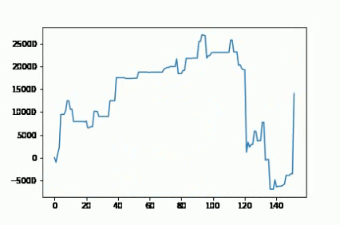

# images2vid
Ever wished you could convert a number of images into a video? Perhaps string together a sequence of graphs to see how they vary as you change a parameter? Well look no further.

<p align="center">

</p>

# Installation
1. Just cd to the directory where requirements.txt is present.
2. ```pip install -r requirements.txt```

# Usage
1. Initialize an object of class VidMaker, with the following inputs:
   a. VidMaker(image_folder_name, image_format, codec_name, output_video_name, output_video_format). 
   For example:
       ```vid_obj = VidMaker("images", ".png", "mp4v", "class_video", ".mp4")```
2. Generate a video with your desired fps rate.
   Eg: ```vid_obj.generate_video(10.0)```
